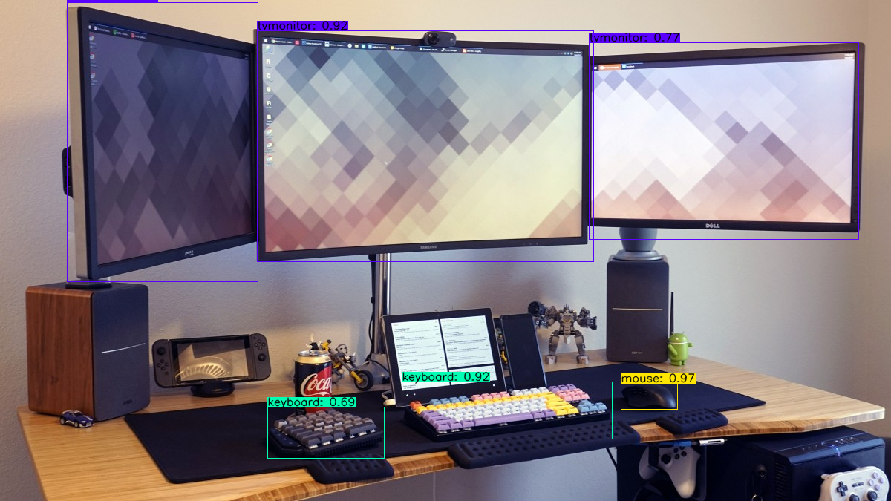

# tensorflow-yolov4-detection-localization
[license](https://img.shields.io/github/license/mashape/apistatus.svg)(LICENSE)

YOLOv4 Implemented in Tensorflow 2.0. 


## Getting Started
### Conda Env (**Recommended**)

```
# Tensorflow CPU
conda env create -f conda/conda-cpu.yml
conda activate yolov4-cpu


```

### Pip Install Requirements (CPU/GPU)
```bash
# TensorFlow CPU
pip install -r requirement/requirements.txt

# TensorFlow GPU
pip install -r requirement/requirements-gpu.txt
```
###
## Downloading Official Pre-trained Weights COCO:
To implement YOLOv4 using TensorFlow, first we convert the .weights into the corresponding TensorFlow model files and then run the model.

Download pre-trained yolov4.weights file: https://drive.google.com/open?id=1cewMfusmPjYWbrnuJRuKhPMwRe_b9PaT

Copy and paste yolov4.weights from your downloads folder into the 'data' folder of this repository.
# Convert darknet weights to tensorflow
## yolov4
python save_model.py --weights ./data/yolov4.weights --output ./checkpoints/yolov4-416 --input_size 416 --model yolov4 


## Downloading Trained Weights From Drive:

Download pre-trained yolov4.weights file: https://drive.google.com/file/d/1TRQ9JtfG_kb7ugP4wj00DvthPfIucRr9/view?usp=sharing

Copy and paste yolov4-obj.weights from your downloads folder into the 'data' folder of this repository.
# Convert darknet weights to tensorflow
## yolov4-obj
python save_model.py --weights ./data/yolov4-obj.weights --output ./checkpoints/custom-416 --input_size 416 --model yolov4 

## Using Custom Trained YOLOv4 Weights : [Camera-Ipod-Laptop-Mobile phone-Tablet computer]
Download obj.names from : https://drive.google.com/file/d/1_tP0Sy5Tucu1nxss_2S7Bx9JOOpdy7C6/view?usp=sharing
 copy and paste your obj.names into the 'data/classes/' folder.


line 14 of 'core/config.py' file --> obj.names
<p align="center"></p>

<strong>Note:</strong> If you are using the pre-trained yolov4 then make sure that line <strong>14</strong> remains <strong>coco.names</strong>.


## YOLOv4 Using Tensorflow (tf, .pb model)

```bash

# Run yolov4 tensorflow model on Image
python detect.py --weights ./checkpoints/yolov4-416 --size 416 --model yolov4 --images ./data/images/desk.jpg
# Run yolov4 on video
python detect_video.py --weights ./checkpoints/yolov4-416 --size 416 --model yolov4 --video ./data/video/video.mp4 --output ./detections/results.avi

# Run yolov4 on webcam
python detect_video.py --weights ./checkpoints/yolov4-416 --size 416 --model yolov4 --video 0 --output ./detections/results.avi


# Run custom yolov4 tensorflow model
python detect.py --weights ./checkpoints/custom-416 --size 416 --model yolov4 --images ./data/images/desk.jpg

# Run custom yolov4 model on video
python detect_video.py --weights ./checkpoints/custom-416 --size 416 --model yolov4 --video ./data/video/cars.mp4 --output ./detections/results.avi


```


<strong>Note:</strong> You can also run the detector on multiple images at once by changing the --images flag like such ``--images "./data/images/kite.jpg, ./data/images/dog.jpg"``

### Result Image(s) (Regular TensorFlow)
You can find the outputted image(s) showing the detections saved within the 'detections' folder.
#### Pre-trained YOLOv4 Model Example
<p align="center"></p>

#### Trained YOLOv4 Model (Connected Object Example)
<p align="center"></p>


### Result Video
Video saves wherever you point <strong>--output</strong> flag to. If you don't set the flag then your video will not be saved with detections on it.
<p align="center"></p>


## Command Line Args Reference

```bash
save_model.py:
  --weights: path to weights file
    (default: './data/yolov4.weights')
  --output: path to output
    (default: './checkpoints/yolov4-416')
  --[no]tiny: yolov4 or yolov4-tiny
    (default: 'False')
  --input_size: define input size of export model
    (default: 416)
  --framework: what framework to use (tf, trt, tflite)
    (default: tf)
  --model: yolov3 or yolov4
    (default: yolov4)

detect.py:
  --images: path to input images as a string with images separated by ","
    (default: './data/images/kite.jpg')
  --output: path to output folder
    (default: './detections/')
  --[no]tiny: yolov4 or yolov4-tiny
    (default: 'False')
  --weights: path to weights file
    (default: './checkpoints/yolov4-416')
  --framework: what framework to use (tf, trt, tflite)
    (default: tf)
  --model: yolov3 or yolov4
    (default: yolov4)
  --size: resize images to
    (default: 416)
  --iou: iou threshold
    (default: 0.45)
  --score: confidence threshold
    (default: 0.25)
    
detect_video.py:
  --video: path to input video (use 0 for webcam)
    (default: './data/video/video.mp4')
  --output: path to output video (remember to set right codec for given format. e.g. XVID for .avi)
    (default: None)
  --output_format: codec used in VideoWriter when saving video to file
    (default: 'XVID)
  --[no]tiny: yolov4 or yolov4-tiny
    (default: 'false')
  --weights: path to weights file
    (default: './checkpoints/yolov4-416')
  --framework: what framework to use (tf, trt, tflite)
    (default: tf)
  --model: yolov3 or yolov4
    (default: yolov4)
  --size: resize images to
    (default: 416)
  --iou: iou threshold
    (default: 0.45)
  --score: confidence threshold
    (default: 0.25)
```


